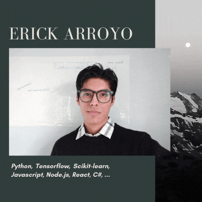

## Hi there, I'm Erick 👋

    
    <h2>
        
        About me
    </h2>
    
I am Junior software developer and a Artificial Inteligence enthusiast.

    <h2>
        
        Interests
    </h2>
    <ul>
        <li>Python</li>
        <li>Data Science</li>
        <li>Artificial Inteligence</li>
        <li>Full Stack Dev</li>
    </ul>

   
    
  
  

    
    
    

<!--
**Erick-INCS/Erick-INCS** is a ✨ _special_ ✨ repository because its `README.md` (this file) appears on your GitHub profile.

Here are some ideas to get you started:

- 🔭 I’m currently working on ...
- 🌱 I’m currently learning ...
- 👯 I’m looking to collaborate on ...
- 🤔 I’m looking for help with ...
- 💬 Ask me about ...
- 📫 How to reach me: ...
- 😄 Pronouns: ...
- ⚡ Fun fact: ...
-->
